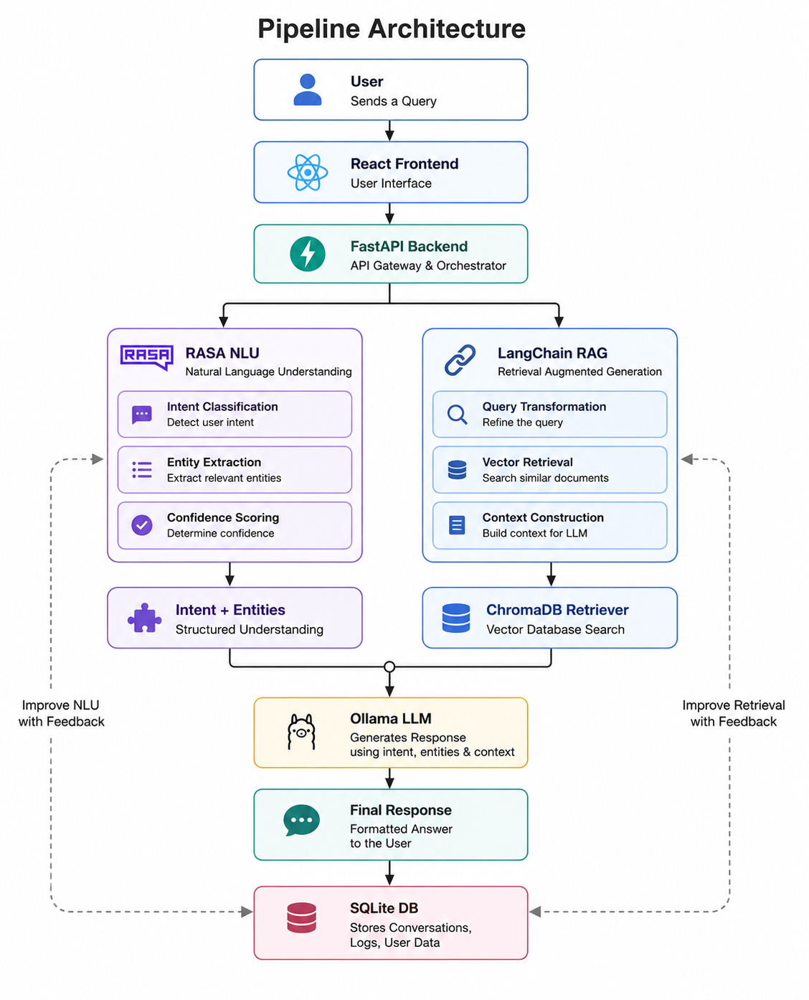
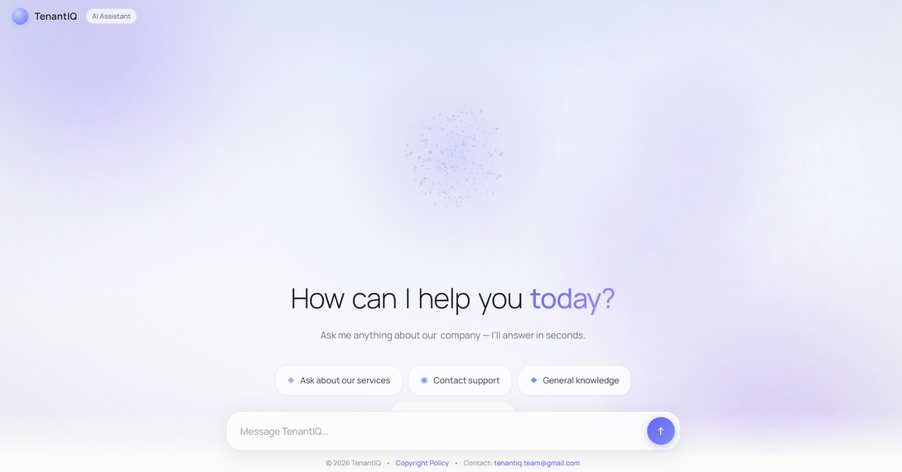

# TenantIQ AI Assistant

A comprehensive, production-ready AI helpdesk assistant **TenantIQ** featuring a **Rasa NLU + RAG pipeline**, a **FastAPI backend**, an **Ollama local LLM**, and a **pixel-perfect React 19 frontend** built with Vite and Tailwind CSS.

---

## 🏗️ Architecture & Tech Stack



### Frontend
- **React 19** & **TypeScript**
- **Vite 6** (Build tool)
- **Tailwind CSS 3** (Styling)
- **Canvas 2D** (Particle Orb & animations)
- **Lucide React** (Icons)

### Backend & NLP
- **FastAPI** (Core API Gateway & Orchestrator)
- **Rasa 3.6** (NLU Pipeline: DIET classifier, ResponseSelector)
- **Ollama (`llama3.2:1b`)** (Local LLM for generative responses)
- **LangChain & ChromaDB** (Vector Database for RAG)
- **Sentence-Transformers** (`all-MiniLM-L6-v2` for embeddings)
- **SQLite & SQLAlchemy** (Logging and system of record)
- **APScheduler** (Automated web crawling)

---

## 📂 Project Structure

```
TenantIQ/
├── actions/                  # Rasa custom actions (RAG hook + local KB)
│   └── actions.py
├── backend/                  # FastAPI Backend Application
│   ├── app/
│   │   ├── api/              # API Routes (chat, crawl)
│   │   ├── core/             # Configuration & APScheduler
│   │   ├── database/         # SQLite setup & DB connection
│   │   ├── models/           # SQLAlchemy DB models
│   │   ├── services/         # Business logic (Crawler, LLM, RAG, Rasa)
│   │   └── main.py           # FastAPI entrypoint
│   └── requirements.txt      # Backend-specific dependencies
├── data/                     # Rasa Training Data
│   ├── nlu.yml               # Intent examples (incl. FAQ retrieval)
│   ├── rules.yml             # Deterministic dialog paths
│   └── stories.yml           # ML training stories
├── rasa-frontend/            # React + Vite Frontend Application
│   ├── src/
│   │   ├── components/       # Chat interface, Layout, ParticleOrb
│   │   ├── hooks/            # Custom React hooks
│   │   └── styles/           # Tailwind & custom CSS
│   ├── package.json          # Node dependencies
│   └── vite.config.ts        # Vite configuration
├── tests/                    # Rasa automated tests
│   └── test_stories.yml
├── config.yml                # NLU pipeline (DIET) & policies (TED, Rule)
├── credentials.yml           # Rasa credentials & channel hooks
├── domain.yml                # Intents, entities, slots, responses
├── docker-compose.yml        # Docker orchestration config
└── requirements.txt          # Root Python dependencies (Rasa)
```

## Setup

Rasa 3.6 requires **Python 3.8–3.10** (3.10 recommended; it will NOT install on 3.11+).

```bash


# Install requirements
pip install -r requirements.txt
```

### 2. Backend Setup
The backend has its own isolated dependencies (FastAPI, LangChain, Chroma, etc.):
```bash
# Still in the virtual environment
cd backend
pip install -r requirements.txt
cd ..
```

### 3. Frontend Setup
Install Node dependencies for the React app:
```bash
cd rasa-frontend
npm install
cd ..
```

---

##  How to Run Locally

To run the complete system manually, you will need multiple terminal windows. 

### Terminal 1: Rasa NLU Server
Starts the Rasa server and exposes the REST API for the backend to consume.
```bash
# Activate your python environment first
.\.venv\Scripts\activate
rasa run --enable-api
```


### Terminal 2: Ollama Local LLM
Ensure the Ollama background service is running on your machine and run the required model:
```bash
.\.venv\Scripts\activate
ollama run llama3.2:1b
```

### Terminal 3: FastAPI Backend
Starts the backend gateway which orchestrates Rasa, ChromaDB, and Ollama.
```bash
.\.venv\Scripts\activate
cd backend
uvicorn app.main:app --reload --port 8000
```
*The backend API will be available at: http://localhost:8000/docs*

### Terminal 4: React Frontend
Starts the Vite development server.
```bash
cd rasa-frontend
npm run dev

## Run

```bash
npm run build    # type-check + production bundle
npm run preview
```
```
*The frontend application will be available at: http://localhost:5173*

```
##


---
## 🐳 Running with Docker

For a streamlined deployment, use Docker Compose. The `docker-compose.yml` sets up the Rasa server, Rasa action server, FastAPI backend, and a production build of the frontend.

Make sure the host machine has Ollama running locally.

```bash
# Build and start all services in detached mode
docker-compose up --build -d

# View logs
docker-compose logs -f

# Stop all services
docker-compose down
```

Services exposed:
- **Frontend**: `http://localhost:3000`
- **FastAPI Backend**: `http://localhost:8000`
- **Rasa NLU API**: `http://localhost:5005`

---

## 🏗️ Build Instructions (Production)

To create a production bundle for the frontend:

```bash
cd rasa-frontend
npm run build    # Type-check + Vite production bundle
npm run preview  # Preview the production build locally
```

---

## 🧪 Testing & Inspection

### Backend Testing Pipeline
1. Navigate to `http://localhost:8000/docs` in your browser.
2. Open the `POST /api/v1/chat` endpoint and execute:
   ```json
   {
     "query": "What are your prices?"
   }
   ```
3. Check the response to verify the full lifecycle (Rasa intent extraction + ChromaDB semantic search + Ollama generative response).
4. Inspect the SQLite `chatbot.db` file to view logged conversational history.

### Rasa ML Testing
```bash
rasa test                 # Runs tests/test_stories.yml + NLU cross-validation
rasa data validate        # Checks domain/data consistency
rasa interactive          # Generates new training data interactively
```
*To add new capabilities, modify `data/nlu.yml` and `domain.yml`, then retrain the model with `rasa train`.*

---

## 🎨 UI & Frontend Migration Notes

- **Canvas 2D Particle Orb**: The visual orb is a 2D projection running on native Canvas 2D (not React Three Fiber) to maintain exact hand-tuned `hsla` depth shading and timings (`0.02 * turb` jitter, `0.94` damping).
- **Exact Timings**: Bot delay `1100 + random() * 500`ms, stream tick 24ms revealing 2–4 chars, and a magnetic pull radius of 110px. 
- **CSS & Animations**: Complex timings are driven strictly by Tailwind `animate-[...]` keyframes rather than Framer Motion to preserve the exact UI/UX timing curves provided in the original specifications.
- **Accessibility**: Includes semantic tags (`header`, `main`, `h1`), `aria-label` implementations, and global `/` shortcut to focus the input field. The `prefers-reduced-motion` flag disables heavy `requestAnimationFrame` loops (orb renders a single static frame) to match original safety requirements.

---

## 🔧 Troubleshooting

- **Python 3.11+ Compatibility Issue**: Rasa 3.6 uses older async loop bindings that clash with Python 3.11+. Ensure you are strictly using `Python 3.10` or lower.
- **Ollama Connection Refused**: When using Docker, the backend attempts to hit Ollama at `http://host.docker.internal:11434`. Ensure `OLLAMA_BASE_URL` is set correctly for your host networking setup if you face connection drops.
- **Missing Knowledge Base Context**: Verify the APScheduler crawler has run at least once (triggered on backend startup) to index the documentation into ChromaDB.
- **Missing Node Packages**: If the frontend fails to start, ensure you've executed `npm install` within the `rasa-frontend` directory.

---
*Rohan this side (it means successfully updated the frontend and backend)*
*Contributions are welcome! Please feel free to submit a Pull Request.*
* If you found this project useful, consider giving it a star!*
